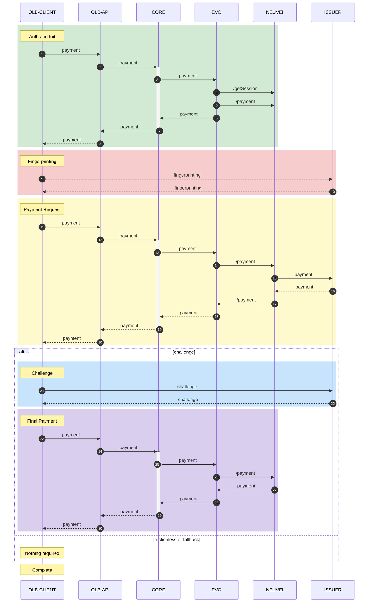

```mermaid
sequenceDiagram
    autonumber
    rect rgb(165, 214, 167, 0.5)
      Note over OLB-CLIENT: Auth and Init
      OLB-CLIENT->>OLB-API: payment
      OLB-API->>+CORE: payment
      CORE->>EVO: payment
      EVO->>NEUVEI: /getSession
      EVO->>NEUVEI: /payment
      EVO-->>CORE: payment
      CORE-->>-OLB-API: payment
      OLB-API-->>OLB-CLIENT: payment
    end
    rect rgb(239, 154, 154, 0.5)
      Note over OLB-CLIENT: Fingerprinting
      OLB-CLIENT-->>ISSUER: fingerprinting
      ISSUER-->>OLB-CLIENT: fingerprinting
    end
    rect rgb(255, 245, 157, 0.5)
      Note over OLB-CLIENT: Payment Request
      OLB-CLIENT->>OLB-API: payment
      OLB-API->>+CORE: payment
      CORE->>EVO: payment
      EVO->>NEUVEI: /payment
      NEUVEI->>ISSUER: payment
      ISSUER-->>NEUVEI: payment
      NEUVEI-->>EVO: /payment
      EVO-->>CORE: payment
      CORE-->>-OLB-API: payment
      OLB-API-->>OLB-CLIENT: payment
    end
    alt challenge
      rect rgb(144, 202, 249, 0.5)
        Note over OLB-CLIENT: Challenge
        OLB-CLIENT->>ISSUER: challenge
        ISSUER-->>OLB-CLIENT: challenge
      end
      rect rgb(179, 157, 219, 0.5)
        Note over OLB-CLIENT: Final Payment
        OLB-CLIENT->>OLB-API: payment
        OLB-API->>+CORE: payment
        CORE->>EVO: payment
        EVO->>NEUVEI: /payment
        NEUVEI-->>EVO: payment
        EVO-->>CORE: payment
        CORE-->>-OLB-API: payment
        OLB-API-->>OLB-CLIENT: payment
      end
    else frictionless or fallback
      Note over OLB-CLIENT: Nothing required
    end
    Note over OLB-CLIENT: Complete
```
